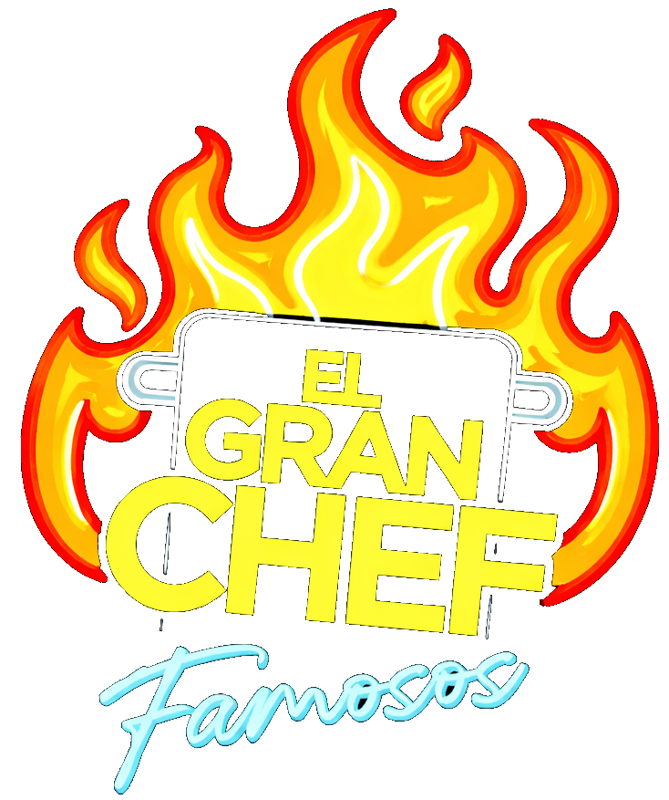
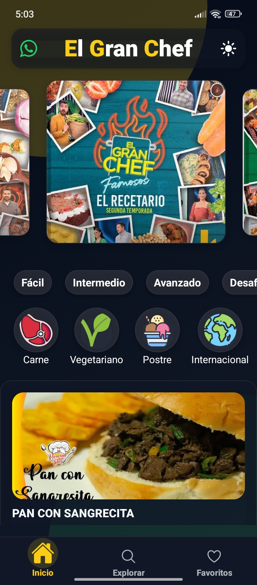
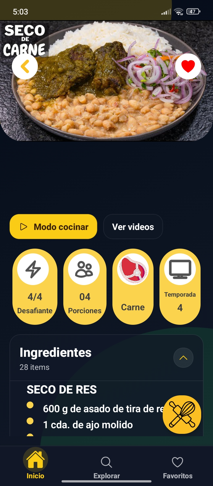
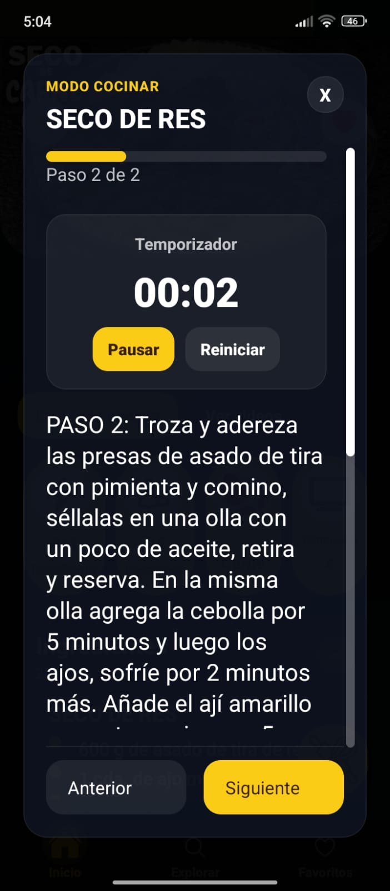
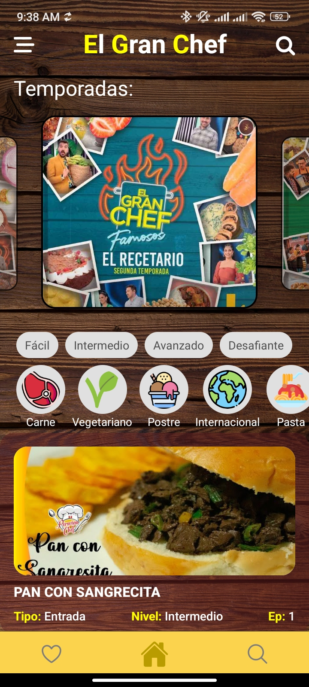
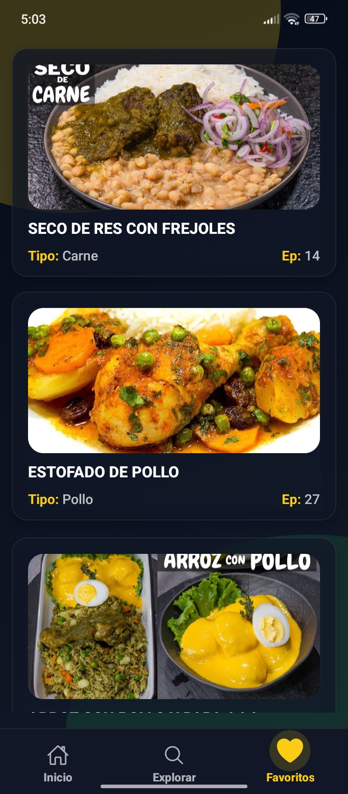

<p align="center">
  
</p>

<h1 align="center">Food App V2</h1>

<p align="center">
  Aplicación móvil fan-made inspirada en <strong>El Gran Chef Famosos</strong>, creada para explorar recetas por temporada, categoría y nivel de dificultad desde una experiencia mobile rápida, visual y fácil de usar.
</p>

<p align="center">
  
  
  
  
</p>

<p align="center">
  
  
  
</p>

## Sobre el proyecto

Food App V2 convierte un recetario de televisión en una app móvil navegable y utilizable en el día a día. El proyecto fue pensado como una mezcla de producto visual y ejercicio técnico: una interfaz con identidad propia, datos locales rápidos de consultar y una experiencia enfocada en cocinar mejor desde el celular.

Actualmente incluye más de 500 recetas organizadas en 5 temporadas, con una navegación pensada para descubrir platos, guardar favoritos y seguir instrucciones paso a paso sin salir de la app.

## Galería

<p align="center">
  
  
  
  
  
</p>

## Funcionalidades principales

- Exploración por temporadas con carrusel visual y recetas destacadas.
- Filtros por categoría y nivel de dificultad desde la pantalla principal.
- Buscador con filtros combinados por nombre, temporada, categoría y dificultad.
- Vista de detalle con ingredientes, preparación, tips, glosario y videos relacionados.
- Modo cocinar con pasos secuenciales, temporizador integrado y pantalla activa.
- Sistema de favoritos persistente con almacenamiento local.
- Tema claro y oscuro con una identidad visual enfocada en mobile.

## Valor técnico

- Arquitectura local-first con `Expo SQLite` para consultar recetas sin depender de backend.
- Base de datos versionada con índices para mejorar búsquedas por `slug`, `temporada`, `tipo` y `nivel_complejidad`.
- Navegación tipada con `Expo Router`.
- Persistencia de favoritos con `AsyncStorage`.
- Soporte para videos de YouTube embebidos dentro de la experiencia de receta.
- Migración de favoritos legacy desde nombres de recetas hacia `slugs` para mantener compatibilidad.

## Stack

- React Native
- Expo
- TypeScript
- Expo Router
- Expo SQLite
- AsyncStorage
- NativeWind
- React Native Reanimated

## Ejecución local

1. Instala dependencias:

```bash
npm install
```

2. Inicia el proyecto:

```bash
npx expo start
```

Comandos útiles:

- `npm run android`
- `npm run ios`
- `npm run web`
- `npm run build:recipes-db` para reconstruir la base SQLite a partir de `data/recetario.ts`

## Objetivo del proyecto

Este repositorio forma parte de mi portafolio como desarrollador. Lo usé para practicar arquitectura mobile con datos locales, experiencia de usuario, navegación tipada y una presentación visual más cuidada que la de un proyecto base.

## Nota

Proyecto fan-made y no oficial, desarrollado con fines de aprendizaje, portafolio y experimentación en desarrollo mobile.
